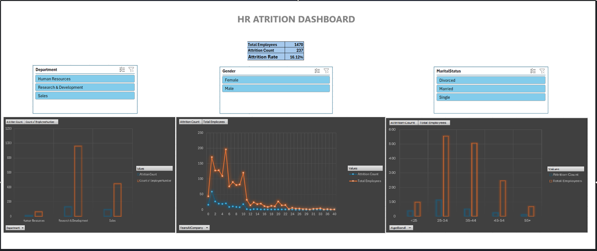
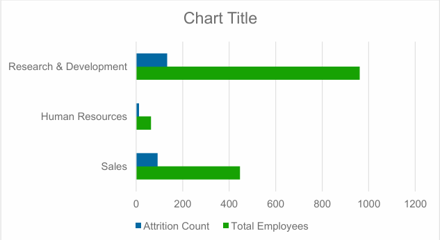
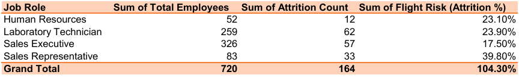
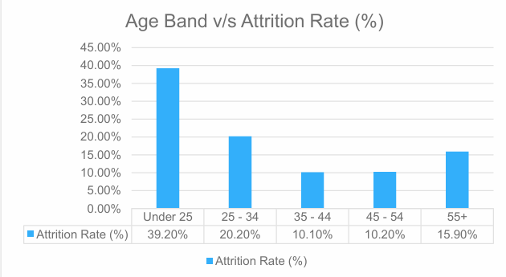
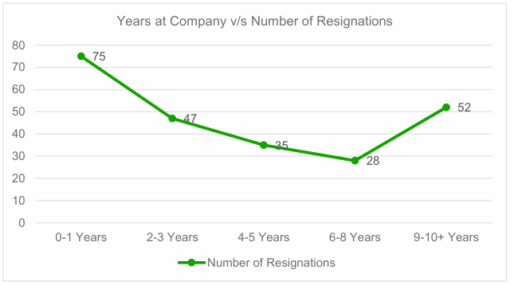

# Corporate HR Retention & Turnover Analytics

## 📌 Project Overview 
Employee turnover is a critical challenge for modern organizations. This project analyzes a comprehensive HR dataset of 1,470 employees to uncover the hidden patterns and root causes behind employee attrition. The objective is to transition from reactive HR operations to proactive, data-driven retention strategies.

## 🛠️ Tech Stack & Tools
* **Data Processing & Analytics:** Advanced Excel (Pivot Tables, KPIs)
* **Database querying:** MySQL (Aggregations, Conditional Statements)
* **Data Visualization:** Interactive Dashboard reporting
* **Documentation:** Business Analyst (BA) Style Executive Summary

## 📊 Key Discoveries & Insights
Based on the SQL queries and dashboard analysis, here are the primary drivers of attrition:

* **Overall Baseline:** The company suffers from an overall turnover rate of **16.1%** (237 exits out of 1,470 employees).
* **High-Risk Departments:** **Sales (20.6%)** and **Human Resources (19.1%)** experience significantly higher attrition compared to Research & Development (13.8%).
* **Most Vulnerable Roles:** **Sales Representatives** face a critical attrition rate of **39.8%**, followed by **Laboratory Technicians (23.9%)**. Senior leadership roles remain highly stable.
* **The "Early Flight" Risk:** Employees under the age of 25 have a massive **39.2%** turnover rate. Furthermore, the highest volume of exits occurs within the first 0-3 years of tenure.

### Departmental Flight Risk

### High-Risk Job Roles

### The "Early Flight" Risk (Age & Tenure)

## 💡 Strategic Recommendations
To combat the high turnover rate, the following actionable strategies are proposed:
1. **Targeted Sales Intervention:** Conduct immediate workload and compensation reviews for Sales Representatives.
2. **Revamp Early Tenure Experience:** Introduce robust mentorship and structured onboarding programs specifically designed for the first 90 days to 1 year.
3. **Career Mapping for Youth:** Provide clear, visible internal mobility and promotion pathways for employees under 25 to improve long-term engagement.

## 📁 Repository Structure
* `HR_Employee_Retention_Data.csv`: The core dataset used for analysis.
* `Turnover_Analysis_Queries.sql`: Contains the MySQL queries used to calculate department, role, and age-band attrition rates.
* `Executive_Summary_Insights.md`: A detailed Business Analyst report covering deep-dive insights and strategic HR recommendations.

---
**Author:** Sakshi Rai 
**Role:** Data Analyst  
**Focus:** Data Analytics | SQL | Business Intelligence
